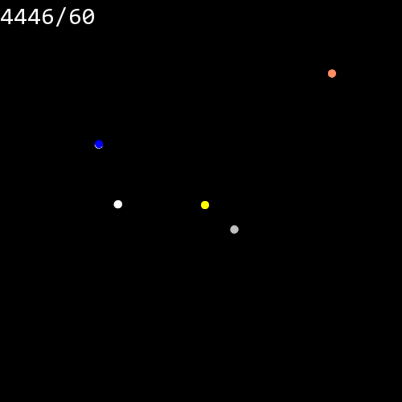

# C++ Gravity

A gravity simulation and visualization I wrote in an attempt to learn C++. [SFML](https://www.sfml-dev.org/) is used for the graphics.

To build the project the `g++` compiler is used and the SFML libraries must be somewhere on the system. `.vscode/tasks.json` automates build+run when using VSCode.

---

#### Behold! The inner solar system:

